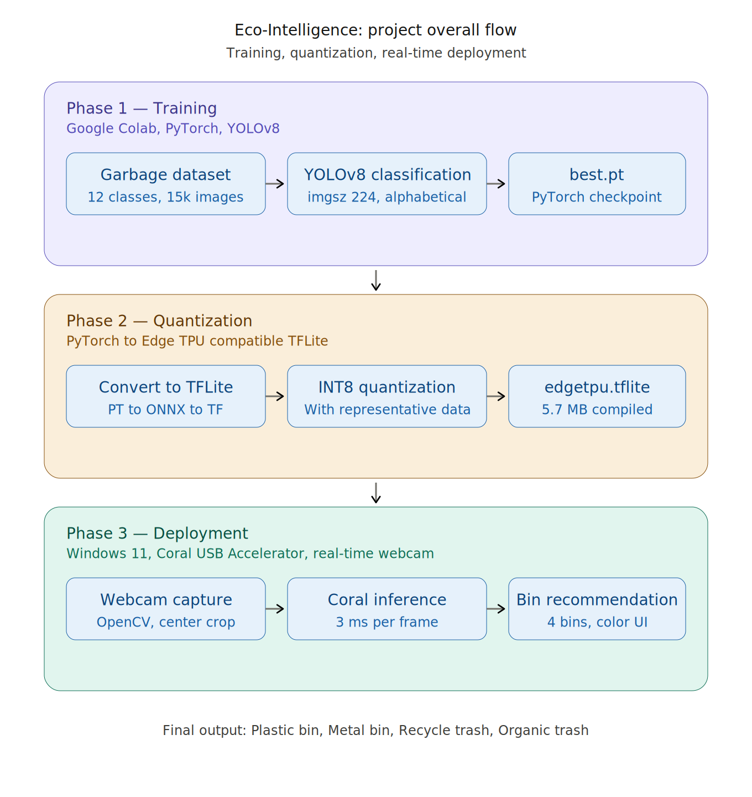

# Eco-Intelligence: Real-Time Garbage Classification on Google Coral Edge TPU

> A real-time waste classification system that runs entirely on a Google Coral Edge TPU. Hold a piece of trash in front of a webcam — the system identifies what type it is and recommends which bin to use. All in about 3 milliseconds per frame.

[](https://medium.com/@m6822040207/draft-garbage-classification-project-4c36945ef982)
[](https://www.python.org/downloads/release/python-390/)
[](LICENSE)
[](https://coral.ai/)

---

## 📖 Project Overview

**Eco-Intelligence** is an edge-based computer vision system that automatically identifies waste items and guides users to the correct disposal bin in real time. Developed for **ICT740 — Hardware and Software Co-design** at **TAIST Sciencec Tokyo Master of Engineering in AIoT Program**, the project demonstrates that meaningful environmental AI applications can be built with affordable, low-power embedded hardware.

The system uses a **YOLOv8 classification model** trained on 12 waste categories, quantized for the **Google Coral Edge TPU**, and deployed with a real-time webcam interface that recommends one of four physical bins.

📰 **Read the full article on Medium:** [Garbage Classification Project](https://medium.com/@m6822040207/draft-garbage-classification-project-4c36945ef982)

---

## ✨ Key Features

- **12-class waste classification** — batteries, biological, brown-glass, cardboard, clothes, green-glass, metal, paper, plastic, shoes, trash, white-glass
- **4-bin disposal scheme** — Plastic Bin, Metal Bin, Recycle Trash, Organic Trash
- **Real-time inference** at 25–30 FPS with ~3 ms per frame on the Coral
- **Polished interactive UI** with corner brackets, confidence progress bar, and color-coded bin swatches
- **Runs entirely offline** — no internet or cloud required after deployment
- **Low-power** — Coral USB Accelerator consumes only ~2 W

---

## 🏗️ System Architecture



The pipeline has three phases:

1. **Training** — YOLOv8 classification model trained on Google Colab (PyTorch)
2. **Quantization** — PyTorch model converted to Edge TPU compatible TensorFlow Lite
3. **Deployment** — Real-time webcam classification on Windows 11 with the Coral USB Accelerator

---

## 🗂️ Bin Assignment

| Class | Bin | Color |
|---|---|---|
| plastic | **Plastic Bin** | 🔴 Red |
| metal | **Metal Bin** | 🟡 Yellow |
| paper, cardboard, brown/green/white-glass, clothes, shoes, batteries | **Recycle Trash** | 🟢 Green |
| biological, trash | **Organic Trash** | 🔵 Blue |

---

## 🔧 Hardware

| Component | Specification |
|---|---|
| **Google Coral USB Accelerator** | 4 TOPS, ~2W power, 8 MB on-chip cache |
| **Host computer** | Windows 11 laptop with USB 3.0 |
| **Camera** | Built-in laptop webcam (any USB webcam works) |

---

## 📊 Dataset

This project uses the **[Garbage Classification dataset by Mostafa Abla](https://www.kaggle.com/datasets/mostafaabla/garbage-classification)** on Kaggle.

- **15,515 labeled images** across 12 classes
- **900–2,500 images per class** (reasonable balance)
- Real-world conditions with varying lighting, backgrounds, and orientations

To download the dataset:

```bash
pip install kagglehub
```

```python
import kagglehub
path = kagglehub.dataset_download("mostafaabla/garbage-classification")
print("Dataset path:", path)
```

---

## 🚀 Getting Started

### Prerequisites

- Windows 11 with USB 3.0 port
- Python 3.9 (specifically — accessible via `py -3.9` launcher)
- Google Coral USB Accelerator
- A USB webcam (the laptop's built-in camera works)

### 1. Install the Edge TPU Runtime

Download the Windows installer from [coral.ai/software](https://coral.ai/software/) and run `install.bat` as Administrator.

Verify in Device Manager — the Coral should appear as **"Coral USB Accelerator"** under "Universal Serial Bus devices."

### 2. Clone or download this repository

```bash
git clone https://github.com/HanHanJimin/Eco-Intelligence-Coral.git
cd eco-intelligence-coral
```

Or download the ZIP from the green **"Code"** button above and extract it.

### 3. Install Python dependencies

```bash
py -3.9 -m pip install -r requirements.txt
```

> ⚠️ **Important:** NumPy must be < 2.0 (already pinned in `requirements.txt`). NumPy 2.x breaks pycoral with an `_ARRAY_API not found` error.

### 4. Run the live classification demo

```bash
py -3.9 classify_trash_webcam_yolo_v9.py --model best_final3_v9_edgetpu.tflite
```

### 5. Controls

| Key | Action |
|---|---|
| `Q` | Quit |
| `SPACE` | Save current frame to `saved_frames_yolo_v9/` |
| `F` | Toggle center-crop / full-frame mode |

---

## 📁 Repository Structure

```
eco-intelligence-coral/
├── README.md                              # this file
├── LICENSE                                # MIT license
├── requirements.txt                       # Python dependencies
├── .gitignore                             # files to exclude from git
├── classify_trash_webcam_yolo_v9.py       # main YOLO deployment script
├── best_final3_v9_edgetpu.tflite          # YOLOv8 Edge TPU model
├── notebooks/
│   └── Hardware_Project.ipynb             # YOLOv8 training notebook
├── docs/
│   └── project_flow.png                   # project pipeline diagram
└── results/
    ├── 01_batteries.jpg                   # live demo screenshots
    ├── 02_biological.jpg
    ├── 03_brown-glass.jpg
    ├── 04_cardboard.jpg
    ├── 05_clothes.jpg
    ├── 06_green-glass.jpg
    ├── 07_metal.jpg
    ├── 08_paper.jpg
    ├── 09_plastic.jpg
    ├── 10_shoes.jpg
    ├── 11_trash.jpg
    └── 12_white-glass.jpg
```

---

## 🧪 Results

The system was tested with all 12 classes under typical indoor lighting. Each class was correctly identified when the item was held inside the center focus region with a plain background. See the [`results/`](results/) folder for screenshots of each class.

| Metric | Value |
|---|---|
| Model file size (Edge TPU compiled) | 5.7 MB |
| Inference time per frame | ~3 ms |
| End-to-end FPS | 25–30 FPS |
| Power consumption (Coral) | ~2 W |
| Operations mapped to Edge TPU | >90% |

---

## 👥 Team Members

This project was developed as a group effort for ICT720 at SIIT, Thammasat University:

| Name | ID | Role |
|---|---|---|
| **Nhat Anh Tran** | 6822040298 | YOLOv8 model training |
| **Napat Charoenwong (Cherry)** | 6822040322 | Model quantization for Edge TPU |
| **Khin Su Su Han (HanHan)** | 6822040215 | Coral USB Accelerator deployment, real-time webcam UI |
| **Thinn Thinn Htet** | 6822040207 | Project documentation, Medium article, Project Testing |

---

## 🔮 Future Work

- **OLED display** alongside the Coral for standalone deployment without a laptop screen
- **Ultrasonic fill-level sensors** to alert users when bins are full
- **Object detection mode** to handle multiple items in the same frame
- **Expanded taxonomy** for e-waste, composite packaging, and medical waste
- **IoT logging** of classification events to a building-management dashboard

---

## 📚 References

- **YOLOv8 by Ultralytics** — https://github.com/ultralytics/ultralytics
- **Garbage Classification (12 classes) dataset by Mostafa Abla** — https://www.kaggle.com/datasets/mostafaabla/garbage-classification
- **Google Coral USB Accelerator** — https://coral.ai/products/accelerator/
- **Edge TPU model requirements** — https://coral.ai/docs/edgetpu/models-intro/
- **TensorFlow post-training quantization** — https://www.tensorflow.org/lite/performance/post_training_quantization

---

## 📄 License

This project is licensed under the MIT License — see the [LICENSE](LICENSE) file for details.

The Garbage Classification dataset is provided by Mostafa Abla under its own Kaggle license terms.

---

## 🙏 Acknowledgments

- **ICT720 Course**
- **Google Coral team** for the Edge TPU hardware and pycoral library
- **Ultralytics** for the YOLOv8 framework
- **Mostafa Abla** for curating and sharing the garbage classification dataset

---

*If this project helps you, please ⭐ star the repository — it helps other students find it.*
